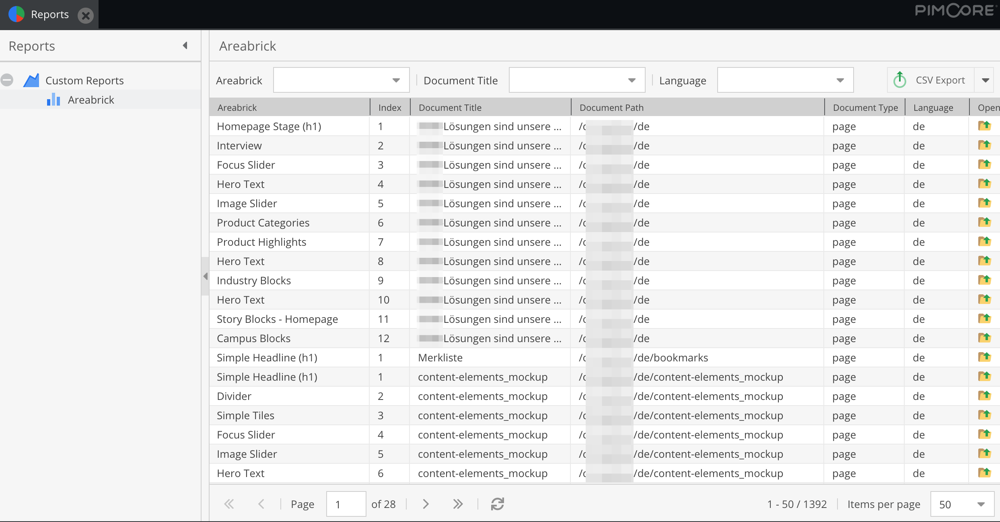
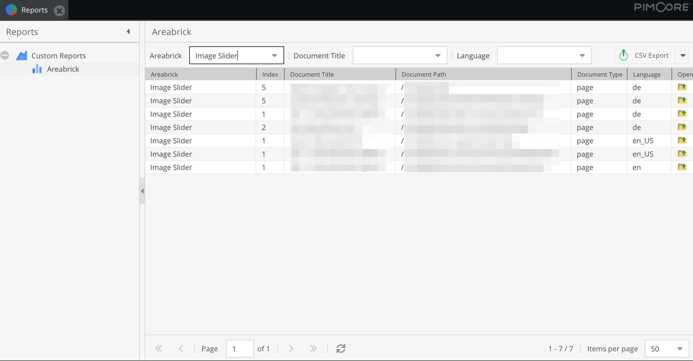
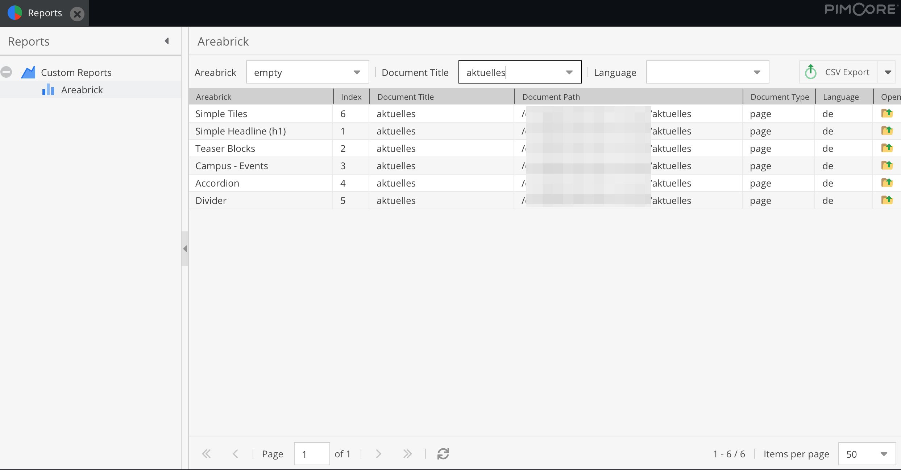
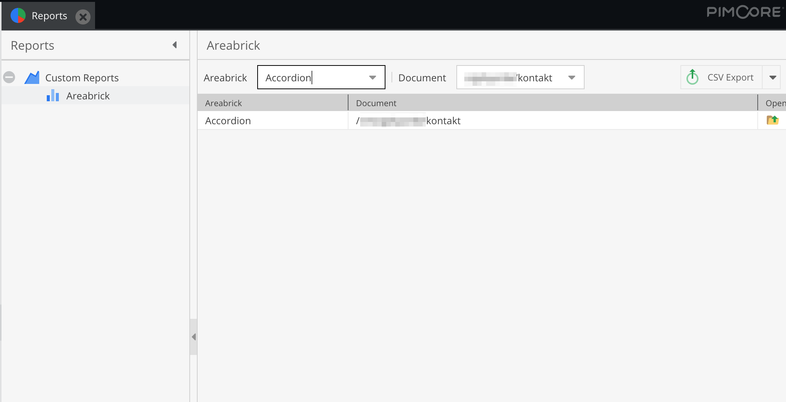

# Installation
```
composer require basilicom/pimcore-bundle-areabrick-report
```

add to bundles.php

```php
return [
    // ...
    PimcorePluginAreabrickReportBundle::class => ['all' => true],
];
```

## Command

Add the command to run every x minutes, depending how often you want to update the data in the report.
```
bin/console basilicom:report:areabrick
```

For updating we suggest to use the force flag, because it will drop and create the database table. 
So it there are changes to the database table it will be updated.
```
bin/console basilicom:report:areabrick -f true
```

# Info

Shows a report with a filter of documents and areabricks.
Cannot be sorted or paginated.



Filter by Areabrick


Filter by Document


Filter by Areabrick and Document

